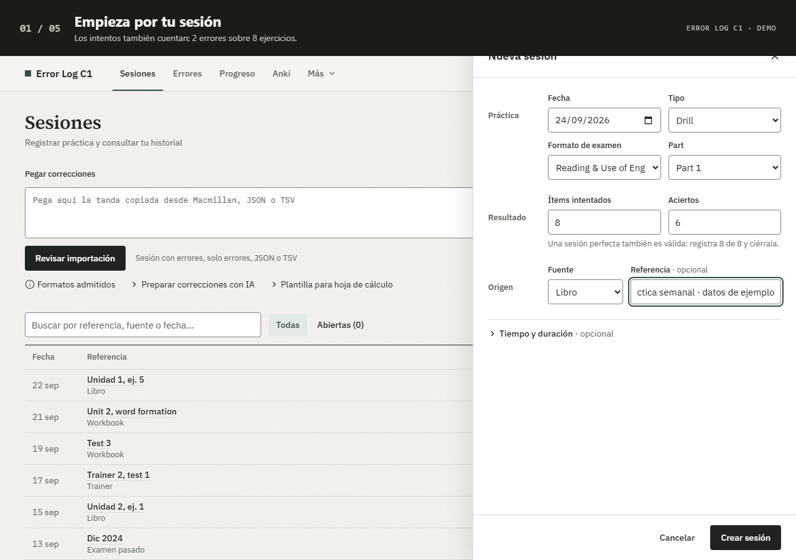
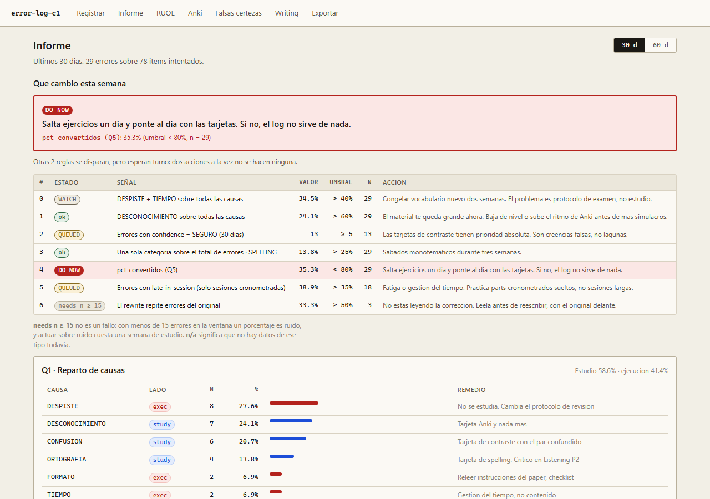
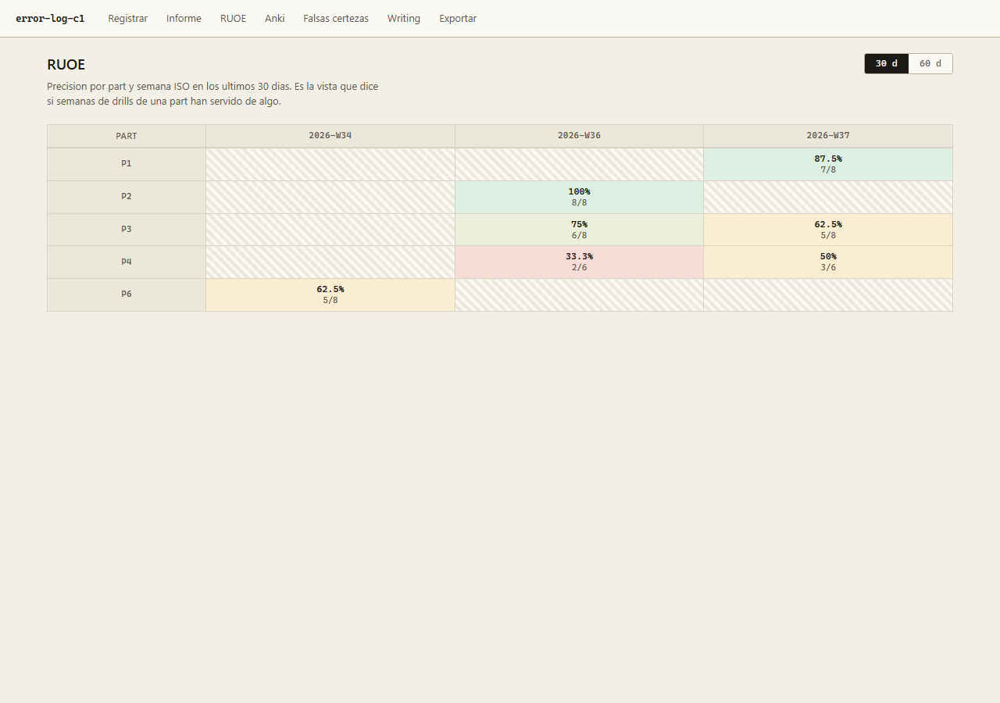

# Error Log C1

**Convierte tus errores del C1 en un plan concreto de estudio.**

[](https://github.com/JuanCardesa/error-log-c1/actions/workflows/ci.yml)
[](LICENSE)

Un registro personal para preparar Cambridge C1 Advanced: guarda qué fallaste y por qué,
revisa tus patrones y elige **una acción para esta semana**. Funciona en tu equipo,
sin cuenta y con tus datos en SQLite.



La demo usa datos ficticios. [Ver el recorrido en imágenes estáticas](docs/DEMO.md).

## Qué puedes hacer

- **Registrar sin repetir trabajo.** Captura individual por teclado o importación de
  hasta 100 errores desde una tabla o un JSON, con vista previa y control de duplicados.
- **Entender el origen del fallo.** Distingue desconocimiento, confusión, ortografía,
  despiste, formato y tiempo; relaciona los errores con los ítems intentados.
- **Decidir qué estudiar.** Siete reglas priorizan una sola acción, con la cifra que
  la dispara y un mínimo de muestra para las reglas de porcentaje.
- **Cerrar el ciclo.** Revisa las tarjetas pendientes de Anki, las falsas certezas y
  los errores que reaparecen al reescribir un texto.
- **Conectar el repaso.** Crea tarjetas en Anki y consulta los fallos por categoría con
  AnkiConnect, mediante sincronización manual.
- **Llevarte tus datos.** Exporta las consultas a CSV, las filas a JSON o una
  copia SQLite restaurable.

| Informe semanal | Evolución de Reading & Use of English |
| --- | --- |
|  |  |

## Empezar

Necesitas **Node.js 22** (la versión de `.nvmrc` y CI) y **pnpm 10.33.2**.
Instala las dependencias desde la carpeta del proyecto:

```bash
git clone https://github.com/JuanCardesa/error-log-c1.git
cd error-log-c1
pnpm install --frozen-lockfile
```

### Probar con ejemplos

```bash
pnpm demo
```

Abre **http://127.0.0.1:3001**. El comando prepara automáticamente una base nueva
con ejemplos en `data/demo/`. Cada arranque empieza de nuevo; las bases anteriores
se conservan y la base personal no se modifica. Sal con `Ctrl+C`.

La demo lleva un aviso en pantalla: los datos son inventados y lo que escribas ahí
no pasa a tu registro. Para tus datos reales, usa `pnpm dev`.

### Empezar con mis datos

```bash
pnpm db:migrate
pnpm dev
```

Abre **http://127.0.0.1:3000**. Tus datos se guardan en `data/errorlog.db`, fuera de Git.
Para ejecutar la versión compilada: `pnpm build` y después `pnpm start`.

Para actualizar una base existente, detén la app y ejecuta `pnpm db:migrate`. Antes de
tocar nada guarda una copia verificada en `data/backups/previa-a-migrar-<fecha>.db`; si
esa copia falla, no migra. Usa este comando también para las migraciones que reconstruyen
tablas: conserva las relaciones y verifica la integridad antes de confirmar los cambios.
No hay migraciones inversas: para volver atrás se restaura esa copia con `pnpm db:restore`.

`pnpm db:seed` sigue disponible para cargar ejemplos en una base **vacía y migrada**.
Si encuentra datos, se detiene sin cambiarlos. Para probar la app, usa `pnpm demo`.

**Uso local y monousuario.** No hay autenticación. Los comandos de arranque escuchan
solo en `127.0.0.1`; la app no está preparada para exponerse directamente a Internet.

## Pegar correcciones

1. En **Sesiones**, pega en **Pegar correcciones**; para añadir a una sesión abierta,
   ábrela y pulsa **Pegar varios**.
2. Pega celdas con las cabeceras de la plantilla o un JSON de errores. Si partes de
   correcciones en texto o fotos, copia las instrucciones de **Preparar correcciones
   con IA** y úsalas en la herramienta que prefieras.
3. Pulsa **Revisar importación**: un índice con el estado de cada error y un editor para
   el elegido. Completa lo pendiente (Alt+↓ salta al siguiente) y ajusta causa y confianza.
4. Guarda la tanda (Ctrl+Intro). Un error repetido en la misma sesión no se duplica ni modifica el anterior.

La app no conecta con una IA ni lee fotos directamente. Si utilizas una herramienta
externa, las correcciones se las facilitas tú. Revisa su respuesta: puede interpretar mal
el ejercicio. Cuando faltan causa y confianza se proponen `DESCONOCIMIENTO` y `DUDABA`.

Una sesión con cero errores también cuenta: es parte del denominador. Las ventanas
del informe son de 30 y 60 días; Falsas certezas usa siempre 30 días.
En Sesiones puedes buscar por referencia, fuente o fecha y filtrar por estado y práctica;
**Errores** busca en todos tus fallos, y Ctrl/⌘+K abre la búsqueda global.

Para ejercicios del libro que no siguen una tarea de Cambridge, elige **Sin formato de
examen** en Formato de examen. No tendrás que indicar Part; sí los ítems y aciertos. Indica unidad,
página y ejercicio en Referencia. Estas sesiones cuentan en el informe general y Anki,
y quedan fuera de la precisión RUOE. Un ejercicio del libro con formato de examen
puede seguir usando su paper y part correspondientes.

Los CSV incluyen la marca UTF-8 para conservar los acentos en Excel. Lo que Excel
evaluaría como fórmula sale con un tabulador protector dentro del campo entrecomillado;
las respuestas normales no se tocan, sufijos como `-ing` o `-ed` incluidos. Si necesitas
el contenido literal para procesarlo, usa el JSON.

## Copias y recuperación

### Crear una copia

```bash
pnpm db:backup
# También puedes elegir un nombre nuevo:
pnpm db:backup data/backups/antes-de-actualizar.db
```

El comando usa la API de backup de SQLite, comprueba la integridad y genera un fichero
independiente, también con la app abierta. Incluye los datos confirmados que aún estén
en el WAL. Nunca sobrescribe una copia existente. Guarda otra copia fuera del equipo.

**No copies solo `errorlog.db` mientras la app esté abierta:** los últimos cambios pueden
estar en `errorlog.db-wal`. [Detalles de SQLite](https://www.sqlite.org/wal.html).

### Recuperar una copia

Detén la app con `Ctrl+C` y restaura a un nombre nuevo:

```bash
pnpm db:restore data/backups/antes-de-actualizar.db data/restored.db
```

La restauración comprueba la copia y rechaza cualquier destino existente, incluidos sus
archivos WAL. Conserva la base anterior hasta comprobar tus sesiones y errores.

Activa el fichero restaurado **en la misma terminal** antes de migrar y arrancar.

PowerShell (Windows):

```powershell
$env:DB_FILE_OVERRIDE = "data/restored.db"
pnpm db:migrate
pnpm dev
```

Bash (macOS/Linux):

```bash
export DB_FILE_OVERRIDE="$PWD/data/restored.db"
pnpm db:migrate
pnpm dev
```

Mantén esa variable en los siguientes arranques para seguir usando el fichero recuperado;
`db:backup` también la respeta. Sin ella se utiliza `data/errorlog.db`.
Si esa ruta predeterminada no existe, puedes restaurar directamente a ella omitiendo
el segundo argumento. Una exportación JSON sirve para portabilidad; aún no hay importación
del volcado completo ni restauración desde la interfaz.

## Progreso y Anki

Progreso prioriza una acción con siete reglas. Las reglas de porcentaje exigen al
menos 15 observaciones en su propio denominador; las falsas certezas usan 30 días.
[Consultas, umbrales y decisiones](docs/SPEC.md#4-consultas-q1q6-del-mvp-y-q7-de-anki).

Para crear tarjetas y leer repasos, instala AnkiConnect y deja Anki abierto.
La app permite crear, actualizar explícitamente y deshacer vínculos, además de
sincronizar el historial. La conversión solo se sella tras verificar la tarjeta.
[Instalación, configuración, funcionamiento y límites](docs/ANKI.md).

## Desarrollo

La búsqueda de texto de sesiones y errores usa coincidencia de subcadenas. Para consultas
de tres caracteres o más, un índice FTS5 de trigramas reduce las filas candidatas; el
filtro original comprueba el resultado exacto. Las consultas más cortas todavía recorren
las filas, y las listas paginadas calculan el total. La paleta muestra hasta cinco errores
y tres sesiones sin calcular ese total. Las entradas se limitan a 200 caracteres.

Next.js (App Router), TypeScript strict, SQLite con Drizzle, Zod, Vitest y Playwright.
CSS Modules, sin librería de componentes. El dominio, las consultas y las reglas son
funciones puras con el reloj inyectado; `src/lib/db/` contiene los adaptadores de persistencia.

```bash
pnpm typecheck
pnpm lint
pnpm test:coverage
pnpm build
pnpm exec playwright install chromium
pnpm test:e2e
```

La suite prueba también que el seed respeta los datos existentes y que una copia con WAL
se restaura conservando filas, relaciones y migraciones. La cobertura de `src/lib/` exige
un mínimo del 90 % en líneas, sentencias, funciones y ramas.

## Aviso

Error Log C1 es un proyecto personal e independiente. No está afiliado, patrocinado ni
respaldado por Cambridge University Press & Assessment ni por ninguna editorial.
«Cambridge» y «C1 Advanced» son marcas de sus titulares y se citan solo para indicar el
examen al que se orienta la herramienta. El repositorio no incluye ejercicios de terceros:
la demo, las capturas y los tests usan contenido inventado.

[Contribuir](CONTRIBUTING.md) · [Contrato del producto](docs/SPEC.md) ·
[Regenerar la demo y las capturas](docs/DEMO.md) · [Licencia MIT](LICENSE)
