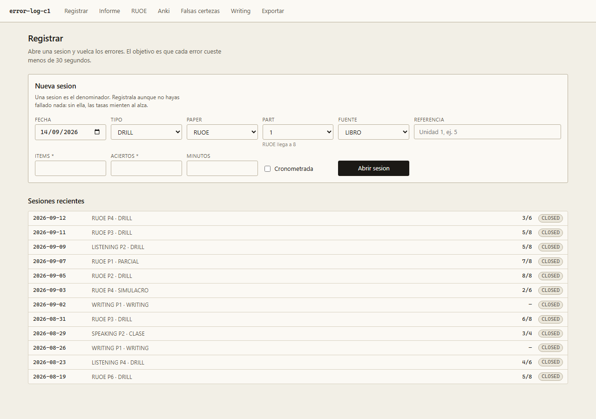
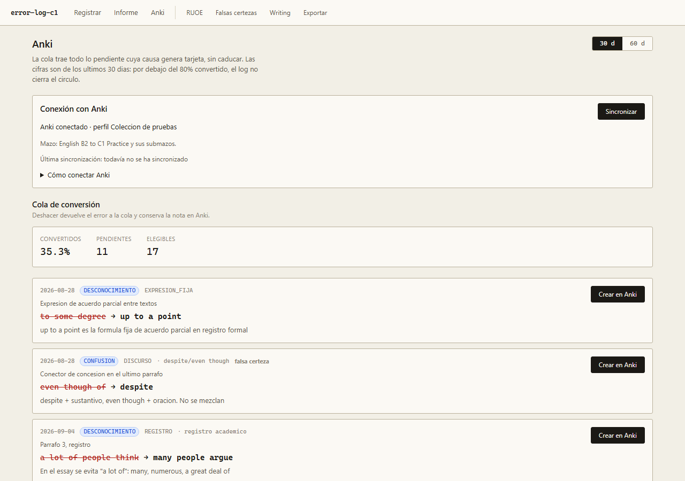

# Error Log C1

Registro de errores para la preparación del **Cambridge C1 Advanced**. Clasifica cada
error por **causa** —qué falló: conocimiento, despiste, formato, tiempo— sobre el
**denominador** de ítems intentados, porque doce fallos en Part 3 es excelente o
desastroso según cuántos hiciste. Un motor de siete reglas convierte esas cifras en
**una sola acción para la semana**, y solo una: un informe con cinco urgencias no ha
decidido nada.

```bash
pnpm install
pnpm db:migrate     # crea ./data/errorlog.db
pnpm db:seed        # opcional: datos de ejemplo
pnpm dev            # http://localhost:3000
```

Local, monousuario, SQLite en un fichero. El backup es copiar `data/errorlog.db`.

---

## Qué hace


El informe es la vista que justifica el resto. Arriba, la única acción destacada, con la
cifra que la dispara. Debajo, las siete reglas con su estado: `DO NOW`, `QUEUED`,
`WATCH`, `ok`, `n/a` o `needs n ≥ 15`.

Ese último estado no es un fallo: **ninguna regla de porcentaje se dispara con menos de
15 errores en la ventana.** Con menos muestra el porcentaje es ruido, y actuar sobre
ruido cuesta una semana de estudio.

### Registrar

**Para pasar correcciones sin transcribir cada campo:** abre una sesión y elige
**Pegar varios errores**. En «Convertir mis correcciones con IA» puedes copiar unas
instrucciones, pegarlas en la IA que uses junto a tus correcciones y traer su respuesta
al registro. También admite celdas copiadas de una hoja de cálculo con las cabeceras
de la plantilla. La app no interpreta texto libre por sí sola ni conecta con una IA.

Revisa los campos ya rellenos, completa lo que falte, quita las filas que no quieras y
pulsa **Guardar errores**. La causa y la confianza se proponen como DESCONOCIMIENTO y
DUDABA cuando no constan; ajústalas a lo que te pasó. La tanda se guarda completa, y
volver a pegar el mismo error en esa sesión no lo duplica ni modifica el anterior.
Se admiten hasta 100 errores por tanda.

**Fotos y capturas:** las mismas instrucciones sirven para una IA que admita imágenes.
Adjunta allí el ejercicio, tus respuestas y la corrección o el solucionario, agrupados
por sesión. Copia su respuesta al registro y comprueba en la vista previa los números
de ejercicio, las respuestas y la regla. Las instrucciones piden dejar vacíos los
datos ilegibles y pedir aclaraciones si no se puede identificar qué ejercicios has
fallado. Esto ayuda a revisar la extracción, pero no garantiza que la IA lea todo bien.
La app recibe el texto preparado; todavía no tiene subida ni lectura directa de fotos.



El requisito que manda sobre todos los demás: **dar de alta un error tiene que costar
menos de 30 segundos.** Si cuesta dos minutos, dejas de registrarlos en tres semanas y el
proyecto entero se cae. De ahí salen las decisiones de esta vista:

- dos variantes conmutables: **grid** para volcar diez errores seguidos, **card** para uno
  a la vez con campos grandes;
- la causa, la categoría y la subcategoría **sobreviven al envío** — dentro de una tanda se
  repiten mucho;
- al guardar, el foco vuelve solo al primer campo;
- el tiempo de registro se mide solo, no se pregunta.

La cabecera se valida **antes** de aceptar ningún error, y una sesión de cero errores es
válida: es el denominador. Si solo guardas sesiones con fallos, todas tus tasas mienten al
alza.

### RUOE y Anki


RUOE cruza part × semana ISO. Las celdas sin datos van rayadas, no a cero: no haber
practicado una part no es haberla fallado.



La cola de Anki solo admite las tres causas que generan tarjeta. Un `DESPISTE` no aparece
ahí por diseño: no se arregla estudiando, se arregla cambiando cómo revisas.

---

## Las seis consultas

| | | |
|---|---|---|
| **Q1** | Reparto de causas | ¿el problema es de conocimiento o de ejecución? |
| **Q2** | Categorías por tasa | normalizado por ítems, no por volumen |
| **Q3** | Precisión RUOE | part × semana ISO |
| **Q4** | Falsas certezas | errores cometidos con `SEGURO` |
| **Q5** | Deuda de Anki | ¿el log cierra el círculo o solo acumula? |
| **Q6** | Eficacia del rewrite | ¿cuántos errores reaparecen al reescribir? |

Todas exportan a CSV, y hay un volcado completo en JSON con las filas crudas.

## Stack

Next.js (App Router) · TypeScript strict · SQLite con Drizzle · Zod · Vitest · Playwright.
CSS Modules, sin librería de componentes.

Toda la lógica de negocio vive en `src/lib/` como **funciones puras** sobre datos en
memoria: las queries no abren conexiones y el reloj se inyecta, así que se testean con
fixtures deterministas y sin base de datos.

## Desarrollo

```bash
pnpm typecheck && pnpm lint && pnpm test && pnpm build   # lo mismo que corre CI
pnpm test:coverage    # cobertura de src/lib (umbral 90%)
pnpm test:e2e         # flujos end-to-end
pnpm screenshots      # regenera docs/screenshots (con SHOOT=1)
```

Flujo de ramas y convenciones en [`CONTRIBUTING.md`](CONTRIBUTING.md).
El contrato del producto —modelo, taxonomías, umbrales— en [`docs/SPEC.md`](docs/SPEC.md).

## Licencia

MIT.
