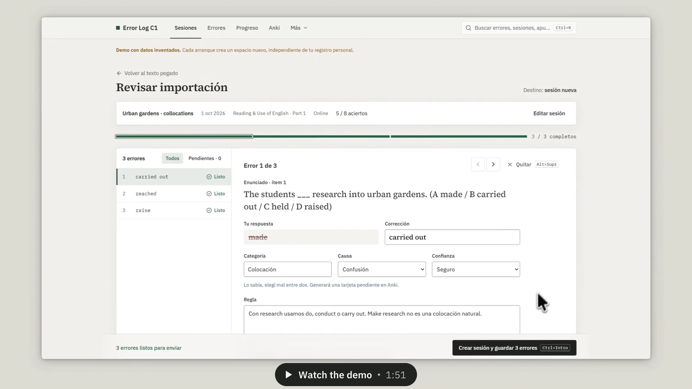
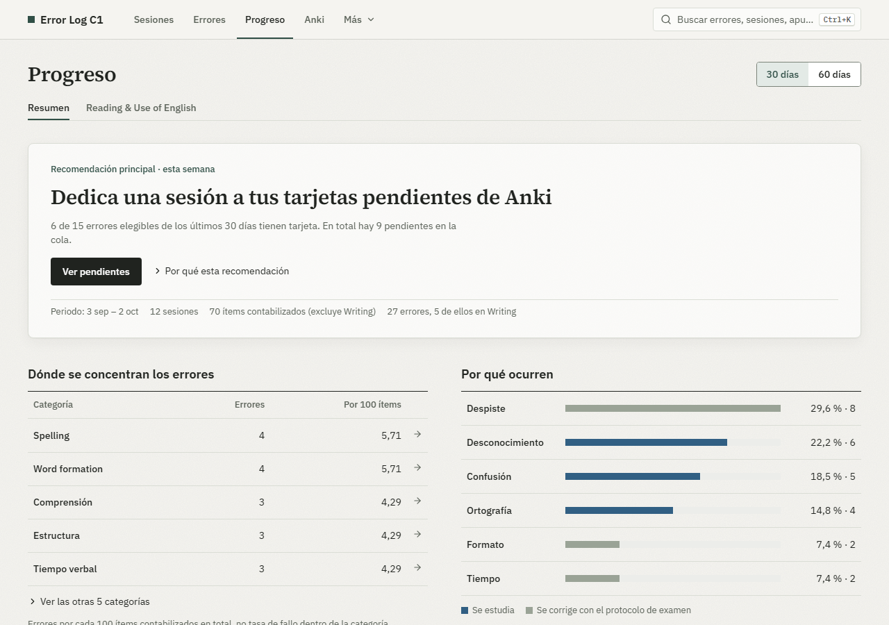
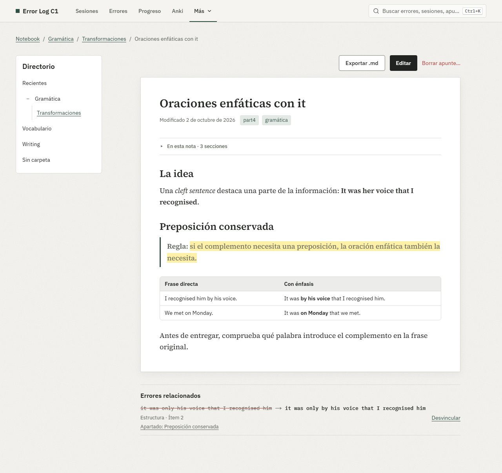

<h1 align="center">
  <picture>
    <source media="(prefers-color-scheme: dark)" srcset="docs/media/wordmark-dark.png">
    
  </picture>
</h1>

<p align="center"><b>Turn your mistakes into your next study step.</b></p>

<p align="center">
  A study log for Cambridge C1 Advanced that runs on your own computer.<br>
  Record what you got wrong and why, see where your mistakes cluster,
  and focus on one study priority at a time.
</p>

<p align="center">
  <a href="https://github.com/JuanCardesa/error-log-c1/actions/workflows/ci.yml"></a>
  <a href="https://github.com/JuanCardesa/error-log-c1/releases/latest"></a>
  <a href="LICENSE"></a>
</p>

<p align="center">
  <b>Spanish interface · Runs locally · No account</b><br>
  <a href="#quick-start">Try it locally</a> &nbsp;·&nbsp;
  <a href="#documentation">Documentation</a>
</p>

<p align="center">
  <a href="https://github.com/user-attachments/assets/b191da2c-9ab6-449a-b76e-7a7fbf8353ad"></a>
</p>

<p align="center">
  <a href="https://github.com/user-attachments/assets/b191da2c-9ab6-449a-b76e-7a7fbf8353ad"><b>Watch the demo</b></a> (1:51, English captions)
  &nbsp;·&nbsp;
  <a href="https://github.com/user-attachments/assets/21fa4430-f354-4717-bb94-1bca991c61b5">Spanish captions</a>
  <br>
  Follow a correction from import to study notes, a priority and an Anki card.<br>
  <sub>No voice-over. All examples are fictional.</sub>
</p>

## Why

Most practice ends the same way: you check the answers, count the mistakes and move on.
Two weeks later the same mistake is back, and its correction is lost somewhere in a workbook.

Error Log C1 keeps your corrections, their context and the reason you got them wrong.
Sessions without mistakes count too: the reports relate errors to the practice you record.

**The cause changes the fix.** Not knowing a collocation and not rereading your answer look
the same on a marked page. The first one you study; the second one you solve with better
exam technique.

## How it works

1. **Practise.** Do a C1 task as usual: a Reading and Use of English part, a Listening part,
   a Writing task or a coursebook exercise.
2. **Log the session.** Note how many items you attempted and got right, then paste the
   corrected mistakes in one go or type them in.
3. **Classify each mistake.** Keep your answer, the correction and the rule in your own
   words, plus a category, a cause and how sure you were.
4. **Read the patterns.** Review recurring categories, causes and accuracy by exam part.
5. **Choose your next step.** When the data triggers a rule, Progress highlights one
   priority and explains why. Otherwise, it tells you there is too little evidence or no
   priority to act on.
6. **Close the loop.** Turn the mistakes you can fix by studying into Anki cards, link them
   to your notes, and go back to practice.

## Quick start

You need **Git**, **Node.js 22** and **pnpm 10**. The repository pins pnpm 10.33.2.
If pnpm is not set up yet, enable it with the Corepack included in Node.js 22:

```sh
corepack enable
```

Then clone the repository and start the demo:

```sh
git clone https://github.com/JuanCardesa/error-log-c1.git
cd error-log-c1
pnpm install --frozen-lockfile
pnpm demo
```

Open **[127.0.0.1:3001](http://127.0.0.1:3001)**. Each start creates a fresh database with fictional data,
separate from your own. The demo does not connect to your Anki collection; use the personal
app below to create and sync real cards. Stop the demo with <kbd>Ctrl</kbd>+<kbd>C</kbd>.

To start with your own data:

```sh
pnpm db:migrate
pnpm dev
```

Open **[127.0.0.1:3000](http://127.0.0.1:3000)**. Saved records live in `data/errorlog.db`, which Git ignores;
unsaved drafts stay in your browser. No environment variables are required. For a production
build, run `pnpm build` and then `pnpm start`. Stop the app before migrating an existing database.

**Using Anki:** install AnkiConnect and keep Anki open when creating or syncing cards
([setup](docs/ANKI.md)). Recording and reports work without it, but the highest-priority
rule addresses errors waiting for Anki cards. That recommendation can remain active if you
choose not to use Anki.

## What you can do

### Log a session without retyping it

Paste a whole session with up to 300 mistakes as JSON, or copy rows straight from a
spreadsheet. A review screen walks you through every mistake before anything is saved. The
batch is written in a single transaction, and retrying the same save doesn't duplicate it.
You can also log mistakes from the keyboard and edit saved errors and sessions.

Corrections on paper or in screenshots? **Prepare corrections with AI**
(*Preparar correcciones con IA*) copies a ready-made prompt for the AI tool of your choice.
You paste its JSON back and review it like any other batch. Error Log C1 itself never
contacts an AI service.

See the [import example and instructions](docs/GUIDE.md#formato-json-de-una-sesión).

### See why, not just what

Each mistake gets one of six causes, one of 14 categories
(collocation, phrasal verb, word formation, dependent preposition…) and a confidence level:
sure, unsure or guessed. Mistakes you were *sure* about get their own list,
**false certainties**: beliefs to correct rather than gaps to fill.

<details>
<summary><b>The six causes and what to do about them</b></summary>

| Cause | What happened | Next step |
| --- | --- | --- |
| Lack of knowledge | You didn't know it | Study it with an Anki card |
| Confusion | You knew the alternatives but chose the wrong one | Study the contrast |
| Spelling | You knew the word but misspelled it | Practise it with a spelling card |
| Oversight | You didn't read or check carefully | Adjust your answer-checking routine |
| Task format | You broke a rule of the task | Review the instructions |
| Time pressure | You ran out of time or rushed | Practise time management |

The first three causes are eligible for Anki cards. The interface and import format use
the Spanish names; the [specification](docs/SPEC.md) lists all values and thresholds.

</details>

### A priority with the evidence behind it

**Progress** evaluates seven rules over your recorded practice and highlights at most one
action. It updates as your data or the selected 30/60-day window changes; it is not a fixed
weekly plan. Pattern-based percentage rules need at least 15 errors in their relevant sample.
Anki conversion and the count of confident mistakes do not use that minimum.

Reports show causes, errors by category per 100 attempted items overall, and Reading and
Use of English accuracy by part and week. The category rate is not a failure percentage
within that category; sessions without item counts, such as Writing, are excluded from it.

[](docs/screenshots/informe.png)

**Writing** records the four assessment bands you enter and links originals to rewrites.
It checks for repeated logged errors by matching category, subcategory and corrected answer.
It does not grade essays or detect mistakes in the text automatically.

### Notes next to your mistakes

**Notebook** keeps your study notes in Markdown, organised in folders and tags, with a
contents list for each note and full-text search with snippets. Link a mistake to a note,
or to one section of it, and the note lists every mistake connected to it. On a computer,
select text to highlight it or mark it in one of four ink colours; the marks are stored
separately from the Markdown. Notes save automatically, unsaved drafts can be recovered,
and you can import one `.md` file at a time or export notes as `.md` and the notebook as ZIP.

[](docs/screenshots/notebook-lector.png)

Screens use fictional data. See the [five-step walkthrough and more screens](docs/DEMO.md).

### Spaced review with Anki

Create Anki cards from eligible mistakes through AnkiConnect, with the question, your answer,
the correction and the rule. New conversions are only confirmed after verification in Anki.
If you edit a linked error, the app flags the changed content and lets you update its card.
Syncing brings your review history back, with failed reviews grouped by category.
Recording and the last synced reports remain available when Anki is closed.

### Search, export and recover

**Errors** searches every answer, prompt and rule, and <kbd>Ctrl</kbd>/<kbd>⌘</kbd>+<kbd>K</kbd>
finds mistakes, sessions and notes from any page.

- **CSV:** report tables for spreadsheets.
- **Markdown / ZIP:** portable notes without study marks. ZIP includes a metadata and
  error-link manifest, but only individual `.md` files can be imported, without restoring
  those links.
- **JSON:** saved records, Anki history and the notebook, including study marks. Full JSON
  import is not implemented.
- **SQLite backup:** the complete saved database for restoration. Browser drafts are
  separate and are not included in exports or backups.

<details>
<summary><b>Back up and restore</b></summary>

```sh
pnpm db:backup
```

This creates a verified copy in `data/backups/`. SQLite's backup API allows it to run while
the app is open. Before migrating an existing database, `pnpm db:migrate` also backs it up
and stops if that copy fails.

With the app stopped, replace `backup.db` below with the filename of your backup.
The destination must not already exist:

```sh
pnpm db:restore data/backups/backup.db data/restored.db
```

Restoring writes to a new file. Follow the [recovery instructions](docs/GUIDE.md#copias-y-recuperación)
to point the app at it before migrating and restarting.

</details>

## Built with

| Layer | Tools |
| --- | --- |
| App | Next.js 16 (App Router, Server Actions), React 19, TypeScript in strict mode |
| Data | SQLite through better-sqlite3, Drizzle ORM with versioned migrations, Zod |
| Search | SQLite FTS5 trigram indexes for sessions, mistakes and notes |
| Interface | CSS Modules without a component library, self-hosted IBM Plex and Source Serif 4 |
| Notebook | react-markdown with remark-gfm |
| Tests | Vitest with v8 coverage, Playwright on Chromium |
| Integration | AnkiConnect over local HTTP |
| Tooling | pnpm, ESLint, GitHub Actions |

## Engineering

- **A pure core.** The seven queries and the rule engine are pure functions over rows, with
  the clock passed in. SQLite access is kept in `src/lib/db/`.
- **The product is a contract.** Taxonomies and thresholds are closed sets in
  `src/lib/domain/`, written down in the [specification](docs/SPEC.md). A threshold doesn't
  change unless the specification changes first.
- **Validated twice.** Zod checks every input, and CHECK constraints and foreign keys in
  SQLite protect what is stored.
- **Saving and recovery.** Imports are transactional and safe to retry. Migrations back up
  existing data first. Notebook uses revision checks to detect conflicting edits and keeps
  a recoverable browser draft ([save reconciliation](src/app/notebook/reconcileSave.ts)).
- **Consistent exports.** Notebook exports read from a database snapshot and stream note
  bodies one at a time, so edits during a download do not mix revisions
  ([export code](src/lib/db/notebookExport.ts)).
- **Explicit missing data.** A week without practice is not shown as 0% accuracy. Rules
  distinguish missing data, insufficient samples and signals below their thresholds.
- **Tested.** More than 850 Vitest tests, with a 90% coverage threshold on `src/lib` for
  lines, branches, functions and statements, and more than 140 Playwright end-to-end tests.
  Tests cover recovery, interrupted Anki operations, conflicting note edits, keyboard use
  and narrow layouts. CI runs type checking, linting, coverage, the build and end-to-end
  tests on pushes and pull requests to `main` and `develop`. The
  [coverage configuration](vitest.config.ts) lists the measured files and exclusions.
- **Strict TypeScript.** `any` and `@ts-ignore` are lint errors.

Run `pnpm typecheck`, `pnpm lint` and `pnpm test:coverage` for local checks.
[Contributing](CONTRIBUTING.md#antes-de-abrir-el-pr) covers end-to-end setup for Bash and
PowerShell, benchmarks, branches and releases.

## Privacy

Error Log C1 is local-first.

- Saved data lives in SQLite on your computer. There's no account and no cloud sync.
- The supplied start commands listen on `127.0.0.1`. There's no login, so the app isn't meant to be
  exposed to the internet.
- The app doesn't call external services. Its only outgoing connection is to AnkiConnect,
  and it rejects any AnkiConnect address that isn't on your own machine.
- There's no AI built in. If you use the AI prompt, you choose the tool and what you send to
  it, and you review the result before it's saved.
- Notes never load remote images or render embedded HTML, and the fonts ship with the app.
- Unsaved drafts, such as a batch under review or a note being edited, are kept in your
  browser's local storage.
- Next.js collects anonymous usage data from its own command-line tool. You can opt out with
  `pnpm exec next telemetry --disable`.

## Status and scope

Error Log C1 is a personal project under active development. It was built for real C1
preparation, and that's what it's used for.

**What it covers today**

- Sessions record the Cambridge C1 Advanced paper (Reading and Use of English, Listening,
  Writing or Speaking), the part, the type of practice (drill, partial or full mock exam,
  class) and the source. Coursebook exercises that don't follow a Cambridge task can be
  logged without an exam format.
- Reading and Use of English and Writing have their own views. Listening and Speaking
  sessions count in the general reports and rules but don't have a dedicated view.
- Accuracy reflects the answers you record. It isn't an official Cambridge score or a
  prediction of your result.
- The interface is in Spanish and designed for one person on a computer. Layouts adapt to
  narrow screens, but the documented setup is accessible only from the computer running
  it; it does not provide access from a separate phone.

**Current limits**

- Notes don't support images, attachments or version history, and `.md` files are imported
  one at a time.
- Backups are restored from the command line, not from the interface.

## Documentation

The detailed guides are in Spanish, like the interface.

| Document | What's in it |
| --- | --- |
| [User guide](docs/GUIDE.md) | Everyday use, the notebook in detail, backups and recovery |
| [Specification](docs/SPEC.md) | Data model, taxonomies, queries and decision rules |
| [Anki](docs/ANKI.md) | AnkiConnect setup, settings and limits |
| [Demo](docs/DEMO.md) | Five-step walkthrough, and how the screenshots and videos are made |
| [Contributing](CONTRIBUTING.md) | Branches, commits, checks and releases |
| [Changelog](CHANGELOG.md) | What changed in each version |

## License

[MIT](LICENSE).

Error Log C1 is an independent personal project. It isn't affiliated with, sponsored by or
endorsed by Cambridge University Press & Assessment or any publisher. "Cambridge" and
"C1 Advanced" are trademarks of their respective owners and are used only to name the exam
the tool is designed for. The repository contains no third-party exercises: the demo, the
screenshots and the tests use invented content.
