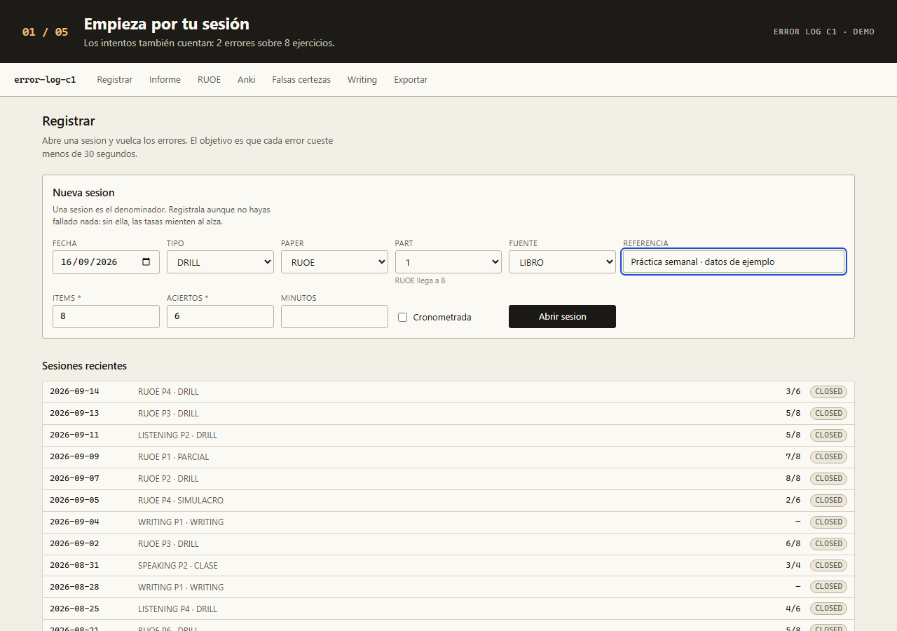
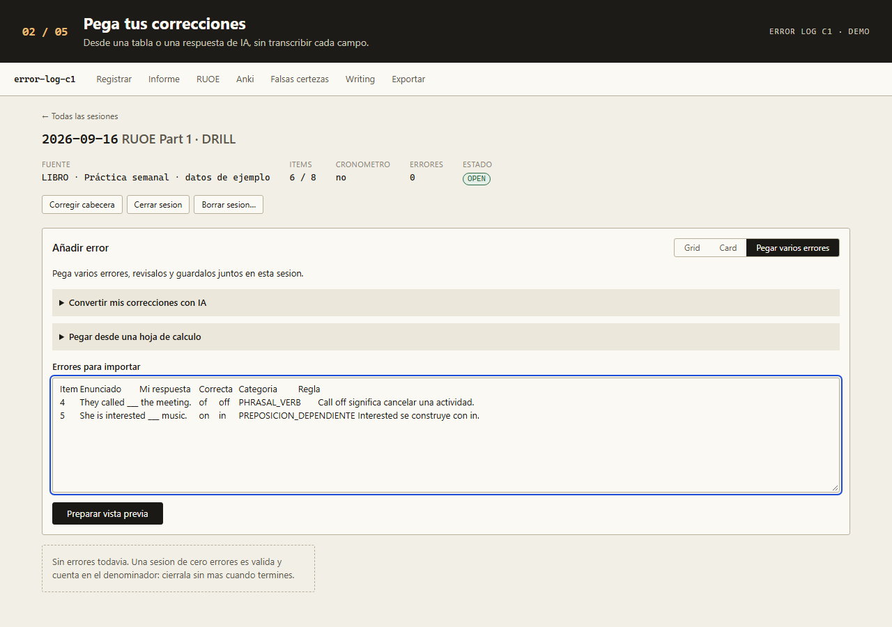
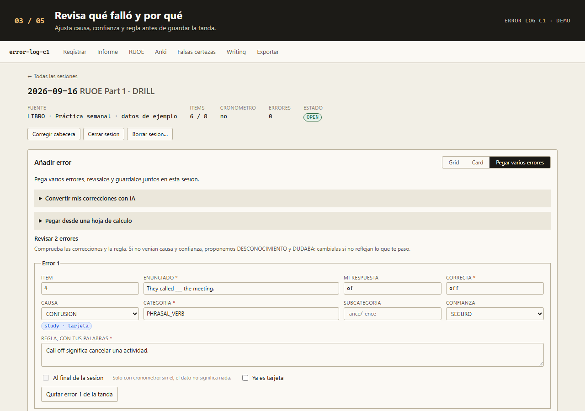
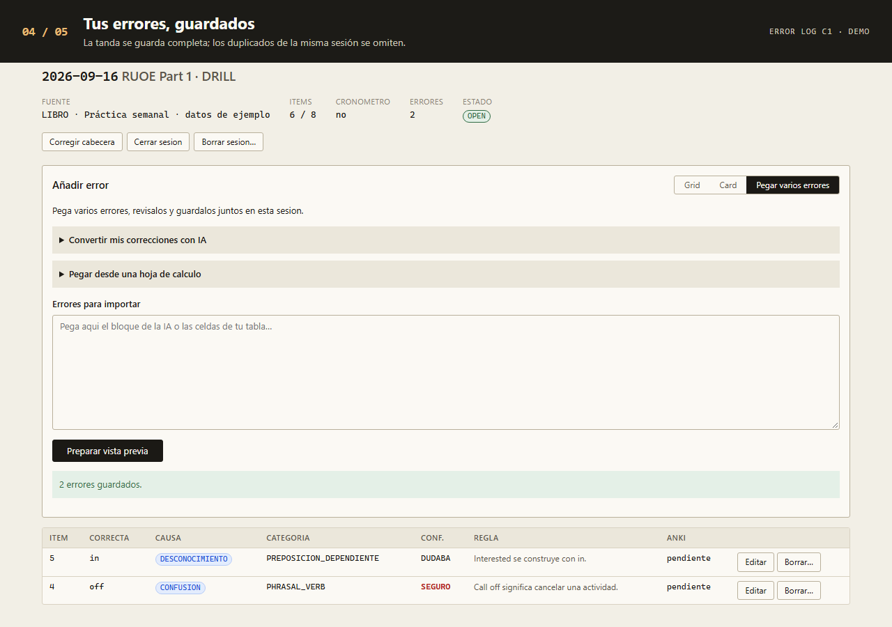
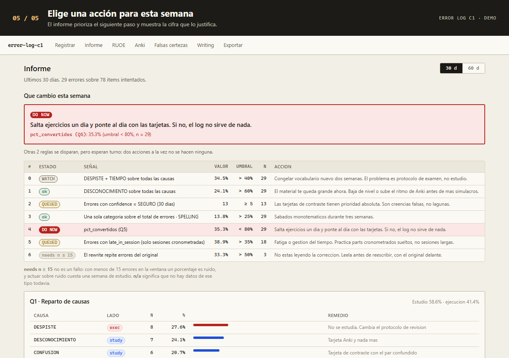

# Error Log C1 en cinco pasos

Este recorrido muestra la app real con datos ficticios. Las mismas imágenes forman el
[GIF del README](media/demo.gif); aquí puedes leerlas a tu ritmo.

## 1. Abrir una sesión

Registra los ítems intentados y los aciertos para que el informe pueda interpretar los errores.



## 2. Pegar las correcciones

La importación acepta una tabla o un JSON preparado con las instrucciones de la app.



## 3. Revisar la tanda

Comprueba las respuestas y ajusta la causa, la confianza y la regla con tus palabras.



## 4. Guardar los errores

La tanda se guarda completa; repetir un error dentro de esa sesión no lo duplica.



## 5. Elegir la siguiente acción

El informe destaca una sola prioridad y explica los datos que la disparan.



## Regenerar los medios

Con las dependencias del proyecto instaladas y el puerto 3210 libre:

```bash
pnpm exec playwright install chromium
pnpm screenshots
```

El comando prepara `data/e2e.db`, compila en `.next-e2e/` y ejecuta el recorrido en
Chromium. Sobrescribe exclusivamente las capturas de `docs/screenshots/` y los cinco
pasos de `docs/media/`; no utiliza la base personal ni reutiliza un servidor existente.

Para codificar el GIF se necesita Python 3 con Pillow:

```bash
python -m pip install Pillow
python scripts/make-demo.py
```

El GIF dura 20 segundos, conserva las capturas completas y no necesita servicios externos.
Revisa las imágenes antes de subirlas: usa siempre ejemplos, sin correcciones personales.
