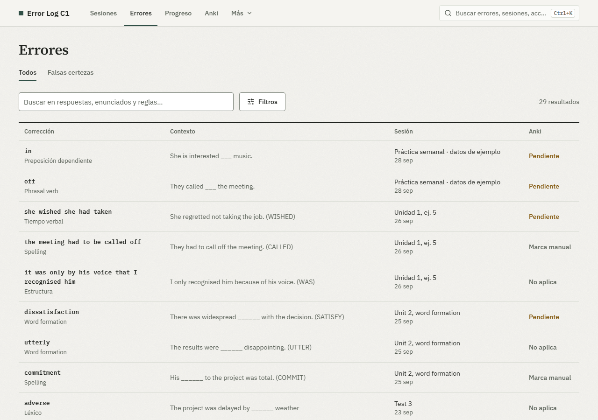
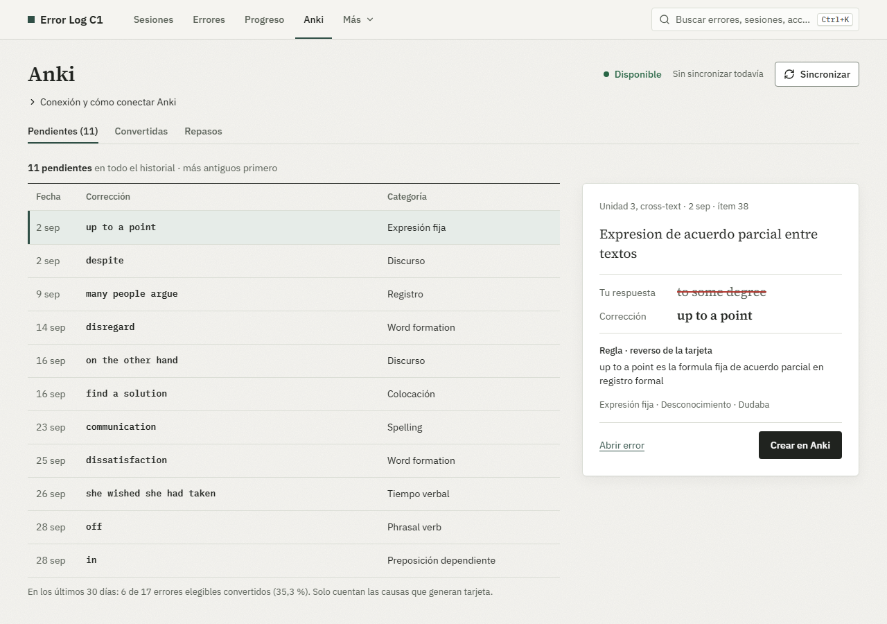

# Error Log C1 en cinco pasos

Este recorrido muestra la app real con datos ficticios. Las mismas imágenes forman un
[GIF de 20 segundos](media/demo.gif); aquí puedes leerlas a tu ritmo.

## 1. Abrir una sesión

Registra los ítems intentados y los aciertos para que el informe pueda interpretar los errores.


## 2. Pegar las correcciones

La importación acepta una tabla o un JSON preparado con las instrucciones de la app.


## 3. Revisar la tanda

Comprueba las respuestas y ajusta la causa, la confianza y la regla con tus palabras.


## 4. Guardar los errores

La tanda se guarda completa; repetir un error dentro de esa sesión no lo duplica.


## 5. Elegir la siguiente acción

El informe destaca una sola prioridad y explica los datos que la disparan.


## Más pantallas

### Buscar errores

Cada corrección conserva su contexto, sesión y estado en Anki.



### Preparar tarjetas

La cola de Anki muestra la respuesta, la corrección y la regla antes de crear la tarjeta.
Esta captura usa el doble de Anki de las pruebas; `pnpm demo` no conecta con tu colección.



## Regenerar los medios

Con las dependencias del proyecto instaladas y el puerto 3210 libre, compila primero
en `.next-e2e`. En Bash:

```bash
ERRORLOG_E2E=1 pnpm build
```

En PowerShell, desde una terminal dedicada:

```powershell
$env:ERRORLOG_E2E = '1'
pnpm build
```

Después, en cualquiera de los dos shells:

```bash
pnpm exec playwright install chromium
pnpm screenshots
```

El comando prepara `data/e2e.db`, usa la compilación de `.next-e2e/` y ejecuta el recorrido en
Chromium. Sobrescribe exclusivamente las capturas de `docs/screenshots/` y los cinco
pasos de `docs/media/`; no utiliza la base personal ni reutiliza un servidor existente.
La captura del lector de Notebook incluye una regla resaltada y la página completa para
mostrar el error relacionado. Cierra la terminal dedicada de PowerShell al terminar para descartar la variable.

Para codificar el GIF se necesita Python 3 con Pillow:

```bash
python -m pip install Pillow
python scripts/make-demo.py
```

El GIF dura 20 segundos, conserva las capturas completas y no necesita servicios externos.
Revisa las imágenes antes de subirlas: usa siempre ejemplos, sin correcciones personales.

La animación `docs/media/demo.webp` sale del vídeo público de 57 s, grabado aparte con datos
ficticios. Fue la cabecera del README hasta el 2 de octubre de 2026, cuando la sustituyó la
miniatura del vídeo completo (más abajo); se conserva por si vuelve a hacer falta. GitHub no
deja que un vídeo se reproduzca solo, pero sí una imagen animada. Se saca con ffmpeg y se
codifica con `img2webp` de
[libwebp](https://developers.google.com/speed/webp/download):

```bash
ffmpeg -i demo.mp4 -vf "fps=12.5,scale=1280:-1:flags=lanczos" frames/%05d.png
img2webp -loop 0 -lossy -q 70 -m 4 -kmin 6 -kmax 12 -d 80 frames/*.png -o docs/media/demo.webp
ffmpeg -ss 0.5 -i demo.mp4 -frames:v 1 -vf "scale=1280:-1:flags=lanczos" -c:v libwebp -quality 85 docs/media/demo-poster.webp
```

No uses el codificador WebP animado de ffmpeg: tras los cambios de pantalla deja restos de la
anterior. `img2webp` con `-kmax 12` pinta un fotograma completo al menos cada 12, y a 12,5
fotogramas por segundo cada uno dura 80 ms exactos, así que la animación no se desfasa del vídeo.

`demo-poster.webp` era su imagen fija para quien tiene activado reducir el movimiento.

### Vídeo completo

El README enlaza otra toma, de 1:51, grabada con el guion de [DEMO_PLAN.md](../DEMO_PLAN.md)
y exportada dos veces, con subtítulos en español y en inglés. Cada vídeo se sube a GitHub
arrastrándolo a un comentario, y GitHub genera un enlace `user-attachments` que sirve el MP4
para reproducirlo en el navegador. El plan gratuito admite vídeos de
hasta 10 MB y el máster de Recordly ocupa unos 30 MB, así que se recodifica a 30 fps en dos
pasadas. Queda en unos 9 MB y el texto se lee igual que en el máster:

```bash
ffmpeg -y -i master.mp4 -vf "fps=30,setsar=1" -c:v libx264 -preset veryslow -b:v 680k -pass 1 -an -f null -
ffmpeg -y -i master.mp4 -vf "fps=30,setsar=1" -c:v libx264 -preset veryslow -b:v 680k \
  -maxrate 2500k -bufsize 5000k -pass 2 -pix_fmt yuv420p -an -movflags +faststart demo-github.mp4
```

`-b:v 680k` corresponde a 1:51. Para otra duración, usa unos 75 000 / segundos kbps.

### Cambiar el vídeo del README

La cabecera del README es una miniatura (`docs/media/demo-thumbnail.webp`) que enlaza con la
versión inglesa; debajo, un texto repite ese enlace y otro lleva a la española. Al subir un
vídeo nuevo:

1. Sustituye en `README.md` la URL inglesa (`…/b191da2c-9ab6-449a-b76e-7a7fbf8353ad`),
   que aparece **dos veces**: en la miniatura y en «Watch the demo».
2. Sustituye la URL española (`…/21fa4430-f354-4717-bb94-1bca991c61b5`), que aparece una vez.
3. Si cambia la duración, actualízala en el texto bajo la miniatura.
4. Regenera la miniatura con un fotograma del máster nuevo. El script sustituye el subtítulo
   incrustado por la píldora «Watch the demo · duración»; espera 1920 × 1080 con los
   subtítulos en una banda bajo el marco, como exporta Recordly con el preset de esta toma.
   Elige un momento sin zoom y con el cursor lejos del contenido:

```bash
ffmpeg -ss 22.4 -i master-en.mp4 -frames:v 1 fotograma.png
python scripts/make-thumbnail.py fotograma.png 1:51
```

El fotograma actual es el segundo 22,4 de `error-log-demo-1080p.mp4`: la revisión de la tanda
con `made` → `carried out`, su causa, su confianza y su regla.

### Imagen para compartir

`docs/media/social-preview.jpg` (1280 × 640) es la imagen que GitHub muestra al compartir el
repositorio. No se puede subir por API: se cambia en **Settings → General → Social preview**.
La versión inglesa (2 de octubre de 2026) conserva el diseño y la captura de la anterior, en
español, y solo sustituye la frase y la línea inferior.

### Grabar la demo de producto

El guion de 104 segundos está en [DEMO_PLAN.md](../DEMO_PLAN.md).
`pnpm demo:record:build` compila la versión de grabación y `pnpm demo:record` arranca
un historial independiente en **http://127.0.0.1:3002**. Cada arranque prepara una toma
nueva con su tanda importable; `pnpm demo:verify` comprueba el recorrido dos veces desde cero.
