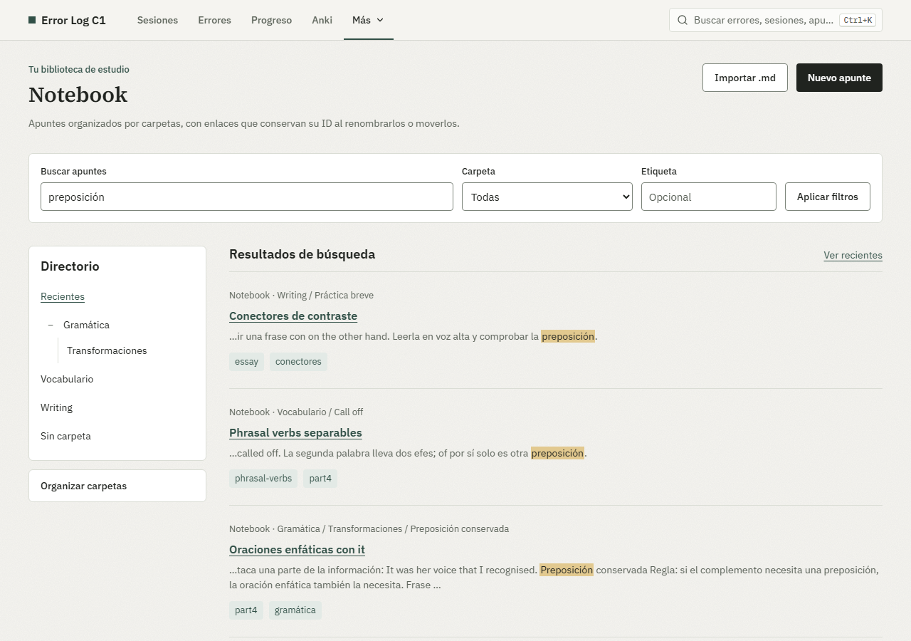

# Guía de uso

El [README](../README.md) presenta Error Log C1 en inglés y explica cómo arrancarlo. Esta guía
reúne el detalle del uso diario, en español como la interfaz: registrar, pegar correcciones,
Notebook, Progreso y Anki, copias y desarrollo.

## Instalar

Necesitas **Node.js 22** (la versión de `.nvmrc` y CI) y **pnpm 10.33.2**.
Instala las dependencias desde la carpeta del proyecto:

```bash
git clone https://github.com/JuanCardesa/error-log-c1.git
cd error-log-c1
pnpm install --frozen-lockfile
```

## Probar con ejemplos

```bash
pnpm demo
```

Abre **http://127.0.0.1:3001**. El comando prepara automáticamente una base nueva
con ejemplos en `data/demo/`. Cada arranque empieza de nuevo; las bases anteriores
se conservan y la base personal no se modifica. Sal con `Ctrl+C`.

La demo lleva un aviso en pantalla: los datos son inventados y lo que escribas ahí
no pasa a tu registro. Para tus datos reales, usa `pnpm dev`.

## Empezar con mis datos

```bash
pnpm db:migrate
pnpm dev
```

Abre **http://127.0.0.1:3000**. Tus datos se guardan en `data/errorlog.db`, fuera de Git.
Para ejecutar la versión compilada: `pnpm build` y después `pnpm start`.

Para actualizar una base existente, detén la app y ejecuta `pnpm db:migrate`. Antes de
tocar nada guarda una copia verificada en `data/backups/previa-a-migrar-<fecha>.db`; si
esa copia falla, no migra. Usa este comando también para las migraciones que reconstruyen
tablas: conserva las relaciones y verifica la integridad antes de confirmar los cambios.
No hay migraciones inversas: para volver atrás se restaura esa copia con `pnpm db:restore`.

`pnpm db:seed` sigue disponible para cargar ejemplos en una base **vacía y migrada**.
Si encuentra datos, se detiene sin cambiarlos. Para probar la app, usa `pnpm demo`.

**Uso local y monousuario.** No hay autenticación. Los comandos de arranque escuchan
solo en `127.0.0.1`; la app no está preparada para exponerse directamente a Internet.

## Pegar correcciones

1. En **Sesiones**, pega en **Pegar correcciones**; para añadir a una sesión abierta,
   ábrela y pulsa **Pegar varios**.
2. Pega celdas con las cabeceras de la plantilla o un JSON de errores. Si partes de
   correcciones en texto o fotos, copia las instrucciones de **Preparar correcciones
   con IA** y úsalas en la herramienta que prefieras.
3. Pulsa **Revisar importación**: un índice con el estado de cada error y un editor para
   el elegido. Completa lo pendiente (Alt+↓ salta al siguiente) y ajusta causa y confianza.
4. Guarda la tanda (Ctrl+Intro). Un error repetido en la misma sesión no se duplica ni modifica el anterior.

La app no conecta con una IA ni lee fotos directamente. Si utilizas una herramienta
externa, las correcciones se las facilitas tú. Revisa su respuesta: puede interpretar mal
el ejercicio. Cuando faltan causa y confianza se proponen `DESCONOCIMIENTO` y `DUDABA`.

Una sesión con cero errores también cuenta: es parte del denominador. Las ventanas
del informe son de 30 y 60 días; Falsas certezas usa siempre 30 días.
En Sesiones puedes buscar por referencia, fuente o fecha y filtrar por estado y práctica;
**Errores** busca en todos tus fallos, y Ctrl/⌘+K abre la búsqueda global.

Para ejercicios del libro que no siguen una tarea de Cambridge, elige **Sin formato de
examen** en Formato de examen. No tendrás que indicar Part; sí los ítems y aciertos. Indica unidad,
página y ejercicio en Referencia. Estas sesiones cuentan en el informe general y Anki,
y quedan fuera de la precisión RUOE. Un ejercicio del libro con formato de examen
puede seguir usando su paper y part correspondientes.

Los CSV incluyen la marca UTF-8 para conservar los acentos en Excel. Lo que Excel
evaluaría como fórmula sale con un tabulador protector dentro del campo entrecomillado;
las respuestas normales no se tocan, sufijos como `-ing` o `-ed` incluidos. Si necesitas
el contenido literal para procesarlo, usa el JSON.

### Formato JSON de una sesión

Puedes pegar la cabecera y hasta 300 errores juntos. Este ejemplo incluye ocho ítems,
siete aciertos y el único error de la sesión:

```json
{
  "session": {
    "date": "2026-10-01", "kind": "DRILL", "paper": "RUOE", "part": 1,
    "source": "ONLINE", "sourceRef": "Urban gardens · collocations",
    "itemsTotal": 8, "itemsCorrect": 7, "timed": false
  },
  "errors": [{
    "itemRef": "1",
    "prompt": "The students ___ research into urban gardens. (A made / B carried out / C held / D raised)",
    "myAnswer": "made", "correctAnswer": "carried out",
    "category": "COLOCACION", "cause": "CONFUSION", "confidence": "SEGURO",
    "ruleNote": "Research goes with do, conduct or carry out. 'Make research' isn't natural."
  }]
}
```

Cambia la fecha y los recuentos por los de tu práctica. `COLOCACION` identifica la
categoría; `CONFUSION`, que conocías las alternativas pero elegiste mal; `SEGURO`, que
creías estar en lo cierto. Revisa esas clasificaciones antes de guardar. Los valores
admitidos están en la [especificación](SPEC.md). Este formato de entrada no es el volcado
completo de **Exportar**: importar `dump.json` no está implementado.

## Notebook: apuntes para repasar

En **Más → Notebook** puedes crear apuntes Markdown, organizarlos en carpetas de hasta
dos niveles y añadir etiquetas. El editor ofrece vista previa, guardado automático,
borradores locales recuperables y **Guardar ahora** (Ctrl/⌘+S). La lectura muestra un
índice de apartados; la búsqueda encuentra títulos, texto y etiquetas. Desde el panel
de un error puedes vincularlo manualmente a un apunte completo o a un apartado.

El lector presenta el apunte como un folio y mantiene **En esta nota** cerrado al entrar.
En ordenador, selecciona texto para abrir **Rotulador · Color · Limpiar**: el rotulador
amarillo y los colores de tinta se guardan automáticamente, sin cambiar el Markdown.
Puedes quitar formato solo de una parte de una frase. Tab lleva el foco a la barra y
Escape la cierra. El código y los controles quedan fuera de las marcas.
Al editar, las marcas se recolocan únicamente si se puede identificar su texto; si no,
se conservan guardadas y el lector muestra un aviso.

Los listados de una carpeta incluyen sus subcarpetas, también sin escribir una búsqueda,
y muestran primero los apuntes modificados más recientemente. Al abrir el editor se
comprueba la versión guardada actual, incluso al volver con Atrás, conservando cualquier
borrador pendiente. Usa **Terminar edición** para volver al lector.

Para eliminar un apunte, pulsa **Borrar apunte…** en el lector y confirma. Se eliminan
el apunte, sus marcas y sus vínculos; los errores de Error Log se conservan. Si el apunte cambió
desde que lo abriste, el borrado se detiene para que revises la versión actual.

Importa **un `.md` por vez** con vista previa. Descarga cada apunte como `.md`, el
cuaderno como ZIP o todos los datos como JSON desde **Exportar**. El ZIP incluye
Markdown y un manifiesto, pero volver a importar sus `.md` no restaura los vínculos
con errores. La demo incluye ocho apuntes ficticios para recorrer estas pantallas.
Las marcas viajan en el JSON (versión 3) y las copias SQLite; las descargas `.md` y ZIP
conservan el Markdown original sin marcas de estudio.

**Límites actuales:** Notebook no admite adjuntos ni imágenes: al leer se muestra su
sintaxis, sin cargarlas. El HTML embebido no se representa. No hay historial de versiones
ni importación de un ZIP completo. La app es local, monousuario y sin autenticación;
para una recuperación íntegra de apuntes, errores y vínculos, usa una copia SQLite
con `pnpm db:backup` y `pnpm db:restore`.

| Lector con índice | Búsqueda con fragmentos |
| --- | --- |
|  |  |

## Progreso y Anki

Progreso destaca como máximo una acción entre siete reglas. Si no hay muestra suficiente
o ninguna regla se activa, lo indica. Las reglas porcentuales de patrones necesitan al
menos 15 errores en su propio denominador; la conversión a Anki y el conteo de falsas
certezas no usan ese mínimo. Las falsas certezas miran siempre 30 días.

Puedes registrar y consultar informes sin Anki, pero la deuda de tarjetas tiene la máxima
prioridad del motor: si decides no convertir errores elegibles, esa recomendación puede
seguir apareciendo. La demo normal no conecta con tu colección de Anki.
[Consultas, umbrales y decisiones](SPEC.md#4-consultas-q1q6-del-mvp-y-q7-de-anki).

Para crear tarjetas y leer repasos, instala AnkiConnect y deja Anki abierto.
La app permite crear, actualizar explícitamente y deshacer vínculos, además de
sincronizar el historial. La conversión solo se sella tras verificar la tarjeta.
[Instalación, configuración, funcionamiento y límites](ANKI.md).

## Copias y recuperación

### Crear una copia

```bash
pnpm db:backup
# También puedes elegir un nombre nuevo:
pnpm db:backup data/backups/antes-de-actualizar.db
```

El comando usa la API de backup de SQLite, comprueba la integridad y genera un fichero
independiente, también con la app abierta. Incluye los datos confirmados que aún estén
en el WAL. Nunca sobrescribe una copia existente. Guarda otra copia fuera del equipo.

**No copies solo `errorlog.db` mientras la app esté abierta:** los últimos cambios pueden
estar en `errorlog.db-wal`. [Detalles de SQLite](https://www.sqlite.org/wal.html).

### Recuperar una copia

Detén la app con `Ctrl+C` y restaura a un nombre nuevo:

```bash
pnpm db:restore data/backups/antes-de-actualizar.db data/restored.db
```

La restauración comprueba la copia y rechaza cualquier destino existente, incluidos sus
archivos WAL. Conserva la base anterior hasta comprobar tus sesiones y errores.

Activa el fichero restaurado **en la misma terminal** antes de migrar y arrancar.

PowerShell (Windows):

```powershell
$env:DB_FILE_OVERRIDE = "data/restored.db"
pnpm db:migrate
pnpm dev
```

Bash (macOS/Linux):

```bash
export DB_FILE_OVERRIDE="$PWD/data/restored.db"
pnpm db:migrate
pnpm dev
```

Mantén esa variable en los siguientes arranques para seguir usando el fichero recuperado;
`db:backup` también la respeta. Sin ella se utiliza `data/errorlog.db`.
Si esa ruta predeterminada no existe, puedes restaurar directamente a ella omitiendo
el segundo argumento. Una exportación JSON sirve para portabilidad; aún no hay importación
del volcado completo ni restauración desde la interfaz.

## Desarrollo

La búsqueda de texto de sesiones y errores usa coincidencia de subcadenas. Para consultas
de tres caracteres o más, un índice FTS5 de trigramas reduce las filas candidatas; el
filtro original comprueba el resultado exacto. Las consultas más cortas todavía recorren
las filas, y las listas paginadas calculan el total. La paleta muestra hasta cinco errores
y tres sesiones sin calcular ese total. Las entradas se limitan a 200 caracteres.

Next.js (App Router), TypeScript strict, SQLite con Drizzle, Zod, Vitest y Playwright.
CSS Modules, sin librería de componentes. El dominio, las consultas y las reglas son
funciones puras con el reloj inyectado; `src/lib/db/` contiene los adaptadores de persistencia.

```bash
pnpm typecheck
pnpm lint
pnpm test:coverage
pnpm build
pnpm exec playwright install chromium
pnpm test:e2e
pnpm bench:notebook
```

La suite prueba también que el seed respeta los datos existentes y que una copia con WAL
se restaura conservando filas, relaciones y migraciones. La cobertura de `src/lib/` exige
un mínimo del 90 % en líneas, sentencias, funciones y ramas. Ramas, commits y publicación
de versiones: [CONTRIBUTING.md](../CONTRIBUTING.md). Demo, capturas y vídeos: [DEMO.md](DEMO.md).
